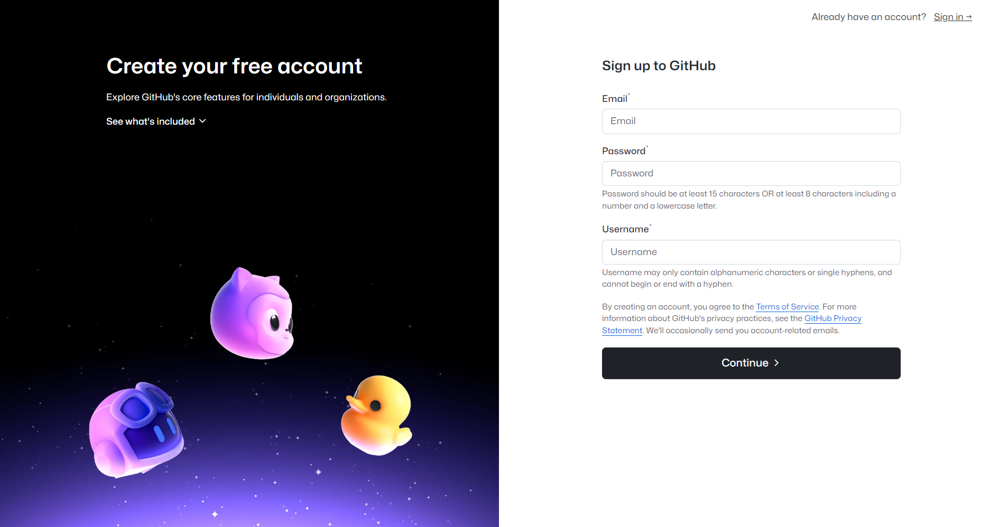

# Teil 2 - Arbeiten mit Git

In der vorherigen Übung hast du automatisiert ein Job-Template in der Ansible Automation Platform erstellt, welches über ein *Survey* (eine interaktive Abfrage) die Möglichkeit bietet, den Webserver (bzw. die vielen Webserver, es werden tatsächlich drei Webserver-Instanzen erstellt) zu personalisieren. Die Abfrage bietet aktuell nur einen einzelnen Namen an, damit auch dein Name dort auftaucht, musst du den Code selbst anpassen.  
Die Code-Anpassung erfordert dass du dich mit dem Versionskontroll-Tool *Git* vertraut machst, die folgenden Schritte bereiten dich und deine Entwicklungsumgebung darauf vor.

## 1. VSCode Entwicklungsumgebung öffnen

## 2. SSH-Schlüsselpaar erstellen

Um den notwendigen Code (das *Repository*) herunterladen zu können und, noch wichtiger, anpassen und wieder hochladen zukönnen, benötigst du ein *Schlüsselpaar*.  

Öffne ein Terminal in VSCode und gib das folgende Kommando ein:

```console
ssh-keygen -t ed25519
```

Die Abfragen kannst du einfach mit ++enter++ bestätigen (drei Mal bestätigen), die Ausgabe sieht in etwa so aus:

```{ .console .no-copy }
[student1@ansible-1 qep]$ ssh-keygen -t ed25519
Generating public/private ed25519 key pair.
Enter file in which to save the key (/home/student1/.ssh/id_ed25519):
Enter passphrase (empty for no passphrase):
Enter same passphrase again:
Your identification has been saved in /home/student1/.ssh/id_ed25519.
Your public key has been saved in /home/student1/.ssh/id_ed25519.pub.
The key fingerprint is:
SHA256:8HXsZw6mD5m6PNl6WHoiYy0B/Il+1zRHVrfcpR+rZpI student1@ansible-1.example.com
The key's randomart image is:
+--[ED25519 256]--+
|                 |
|           .  . o|
|   .  .   . o..o+|
|    o  o . oo .+.|
|     + .S  o+ o.o|
|    . +   +=.= ..|
|   .   o O=o. o  |
|    . *.O.=E +   |
|     o ==B  =    |
+----[SHA256]-----+
```

Du hast ein neues SSH (Secure Shell) Schlüsselpaar erstellt, einen *privaten* Schlüssel und einen *öffentlichen* Schlüssel (mit der Endung `.pub` für *public*), welchen du gefahrlos verbreiten darfst. Wir werden diesen öffentlichen Schlüssel im nächsten Schritt benötigen, du kannst ihn dir bereits einmal auf der Kommandozeile anzeigen lassen, von dort kannst du ihn gleich markieren und kopieren.

```console
cat ~/.ssh/id_ed25519.pub
```

??? example "Beispielausgabe"

    ```{ .console .no-copy }
    [student1@ansible-1 qep]$ cat ~/.ssh/id_ed25519.pub
    ssh-ed25519 AAAAC3NzaC1lZDI1NTE5AAAAIDt+WFoUBWhs77m/784FaT+eqqavHf/Jz/+8DW04l2fP student1@ansible-1.example.com
    ```

## 3. Github-Account erstellen

Der Code für das Job-Template in der Automation Platform befindet sich in der Git-Hosting Plattform **Github**, um an dem Projekt (Repository) mitarbeiten zukönnen, benötigst du einen Account.

Öffne den folgenden Link: [https://github.com/signup](https://github.com/signup){ target=_blank }


