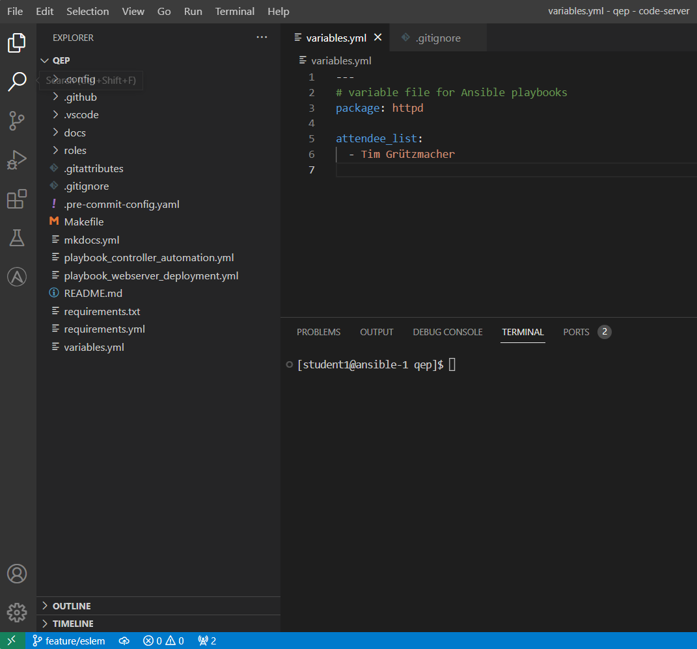
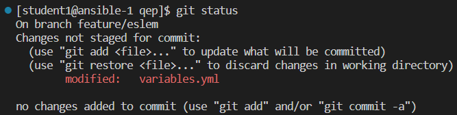
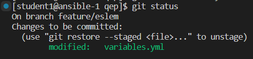

# Teil 3 - Update Code

In der vorherigen Übung hast du (automatisiert) ein Job-Template in der Automation Platform erstellt, mit einem Survey zur Personalisierung des Webservers.  
Damit dein Name ebenfalls in der Auswahlliste des *Surveys* auftaucht, muss der *Code* (die *Listen*-Variable) angepasst werden.  
Du durchläufst dabei einen typischen *Entwicklungs-Workflow*, du verwendest das Versionskontroll-Tool *Git* und (den Git-Hosting-Service) *Github*, erstellst einen *Issue*, wirst auf der Kommandozeile den Code nach deinen Wünschen anpassen und anschließend einen *Merge Request* (*Pull Request*) erstellen.

``` { .mermaid }
gitGraph
   commit
   commit
   branch dev
   checkout dev
   commit
   branch feature/name
   checkout feature/name
   commit id: "Added name to attendee_list"
   checkout dev
   merge feature/name
   checkout main
   merge dev
   commit type:HIGHLIGHT
```

## 1. Vom Remote Repository zum lokalen Repository

Das Projekt vom *Remote Repository* herunterladen (*klonen*):

```console
git clone https://github.com/TimGrt/qep.git
```

Ein neuer Ordner ist entstanden, in diesen wechseln (*cd* means *change directory*):

```console
cd qep
```

Du bist jetzt in einem *git-versionierten* Ordner, prüfe mit dem Kommando `git status`, der Output sollte folgendermaßen aussehen:

``` { .console .no-copy }
[student1@ansible-1 qep]$ git status
On branch dev
Your branch is up to date with 'origin/dev'.

nothing to commit, working tree clean
```

> Du befindest dich auf dem `dev`-Branch. Dieser Branch ist *schreibgeschützt* (lediglich über einen Pull Request können Änderungen hinzugefügt werden).

Erstelle einen eigenen (lokalen) Branch mit deinem Namen, in der Form `feature/<dein-name>`:

```console
git checkout -b feature/name
```

!!! warning "Alles korrekt?"
    Hast du `name` gegen deinen eigenen Namen ausgetauscht?

Du hast vom `dev`-Branch einen weiteren Branch abgezweigt, auf diesem wirst du deine Änderungen hinterlegen. Du kannst mit `git status` erneut prüfen.

## 2. Variablen-Datei anpassen

Füge in der Datei `variables.yml` deinen Namen in der Liste hinzu, damit das *Survey* im *Webserver Deployment* Template diesen als Option für den personalisierten Webserver anbietet.  
Du kannst die Datei im *Explorer* links anklicken, sie wird im *Code Editor* geöffnet und kann dort editiert werden:



Die Datei ist im sog. *YAML*-Format (ein Datenserialisierungsformat), füge in der Variablen `attendee_list` deinen Namen als weiteren Listeneintrag hinzu (beginnt mit einem *Minus* (*Dash*) Symbol), achte dabei auf die Einrückung (zwei Leerzeichen vor dem *Minus*-Symbol)

!!! abstract "Inhalt der Variablen-Datei vor der Anpassung"

    ```{ .yaml .no-copy }
    --8<-- "variables.yml"
    ```

Am Ende sollte die Datei folgendermaßen aussehen (mit eurem Namen natürlich):

```yaml
---
# variable file for Ansible playbooks
package: httpd

attendee_list:
  - Tim Grützmacher
  - Eslem Bayraktar
```

## 3. Änderung *commiten*

Da sich das Projekt unter Git-Versionskontrolle befindet, kannst du jede Veränderung überprüfen. Gib `git status` ein, du siehst, dass es eine Änderung in einer einzelnen Datei gibt (die von dir zuvor angepasste Datei `variables.yml`).



Mit dem folgendem Kommando fügst du die veränderte Datei hinzu (zu deinem geplanten *Commit*):

```console
git add variables.yml
```

Anschließend sieht der Output vom `git status` Kommando etwas anders aus:



Jetzt wird die Änderung *commited*. Damit alle weiteren Entwickler auch wissen, welche Veränderung am Code vorgenommen wurde, solltest du dem *Commit* eine entsprechende Nachricht (*Message*) mitgeben.

```console
git commit -m "Added new name to attendee_list"
```

!!! tip
    Du kannst die Nachricht natürlich auch personalisieren, ansonsten das Kommando oben einfach kopieren, einfügen und ausführen.

!!! failure "Eine Fehlermeldung?"
    Das Kommando endet mit einer `Author identity unknown` Fehlermeldung.  
    Das war zu erwwarten, du musst Git erst einmal sagen, wer du bist!

Damit Git und die restlichen Entwickler auch wissen, wer die Änderung vorgenommen hat, musst du Namen und E-Mail angeben (die Fehlermeldung gibt die passenden Kommandos vor). Als E-Mail-Adresse (`user.email`) musst du **die gleiche Adresse verwenden, mit welcher du dich bei Github angemeldet hast**, als Name (`user.name`) Vor- und Nachname.

Kopiere dir die beiden Kommandos aus der Fehlermeldung, passe sie entsprechend an und führe sie einzeln aus.

??? success "Hilfe benötigt?"
    Hier sind die Kommandos noch einmal:

    ```console
    git config --global user.email "you@example.com"
    ```

    > **Nutze die gleiche E-Mail-Adresse mit welcher du dich bei Github angemeldet hast!**

    ```console
    git config --global user.name "Your Name"
    ```

    > **Statt `Your Name` sollte natürlich dein richtiger Name hinterlegt werden!**

Nachdem du Git deine Identität mitgeteilt hast, kannst du den *Commit* noch einmal ausführen.  
Mit der ++arrow-up++-Taste kannst du zum vorherigen Kommando zurück, sobald du es erreicht hast, einfach mit ++enter++ bestätigen.

```console
[student1@ansible-1 qep]$ git commit -m "Added new name to attendee_list"
[feature/eslem 4dea3cf] Added new name to attendee_list
 1 file changed, 1 insertion(+)
```

Das sieht gut aus, du hast deine Änderung *lokal* versionkontrolliert. Im nächsten Schritt werden wir die Änderung im Github-Repository veröffentlichen.

## 4. Branch veröffentlichen

Nachdem du die gewünschten Änderungen am Code vorgenommen hast und lokal versionskontrolliert hast, muss sie jetzt auch veröffentlicht werden.  

Führe das folgende Kommando aus:

```console
git push -u origin
```

!!! failure "Noch eine Fehlermeldung?"  
    Auch das war zu erwwarten, das *Remote*-Repository auf Github kennt deinen Branch noch gar nicht!

Du musst Git mitteilen, welcher *Remote*-Branch zu seinem lokalen Branch gehört (du erstellst einen sogenannten *Tracking-Branch*). Auch hier gibt die Fehlermeldung wieder einen Lösungsvorschlag vor, den kannst du wieder kopieren (mit *Strg* + *C*) und ausführen.

??? success "Hilfe benötigt?"
    Hier ist das Kommando noch einmal:

    ```console
    git push --set-upstream origin feature/eslem
    ```

    > **Bei mir heißt der Branch lokal natürlich anders als bei dir, hinterlege deinen eigenen Branch `fature/name`.**

Der Output gibt an, dass der Branch veröffentlicht wurde, unter dem folgenden Link siehst du jetzt auch im Github deinen Branch mit deinen Code-Änderungen:

[https://github.com/TimGrt/qep/branches](https://github.com/TimGrt/qep/branches){ target=_blank }

## 5. Pull Request erstellen

Dein Code ist fertig, jetzt muss er noch in den passenden Branch überführt werden (in der AAP im *Project* wurde der `dev` Branch hinterlegt).  

Im Github Projekt, klicke oben auf **Pull Request** und klicke auf der rechten Seite auf den grünen Button **New pull request**.  
